> 该文章主要驳斥无机成因.  
作者: 云舞空城

一块质地松脆，颜色发黑，密度不高的岩石，竟然可以直接用明火点燃，是不是出乎了很多人的想象？

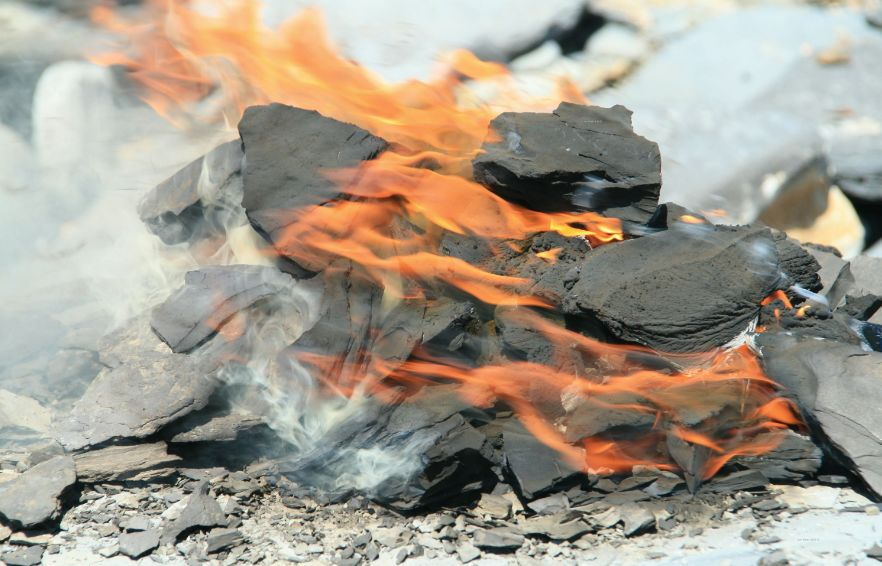

疏松的质地是泥岩/页岩的共性，能够燃烧则是因为它含有各种各样的复杂有机物，有时被称为页岩油.

就在那不见天日的湖泊或大海深处，细小的沉积物颗粒正日复一日的堆积在水底.

# 你有没有想过，为什么淤泥那么臭?

那些随着枯水季节露出来的泥地，虽然变得干燥长满了草，时不时还能看见一两条眼神空洞的死鱼。这些表面发褐的土地，翻开来看确是黑色不行，闻起来更是令人作呕。

这就是生命逝去的味道：上一年死去的动植物尸骸，化作细小的有机残渣隐藏在淤泥里.

如果用石油地质专业的术语，这叫未熟的生物成因天然气，富含甲烷，也含有其他烃类及非烃类——说白了就是沼气。对，就在你家后面的荷花池里，正在缓慢发生着有机质生成油气的第一步。

# 闭上眼睛，想象一场落在海洋深处的“雪”

当然，这不是真正的雪花，而是来自上方2000米海水中的生物残渣。
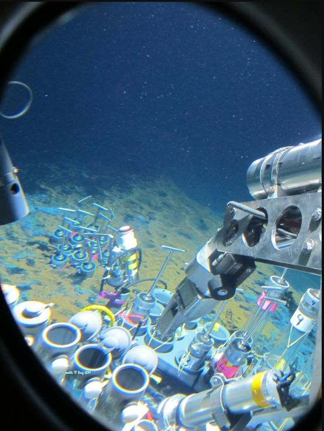

海洋，是一个巨大的搏杀场。这里每天都上演着猎杀与捕食，破碎的肉块骨渣连同死去的浮游生物一起，缓缓沉降到海床上。如果考虑到海洋生物的进食作用，并生物残渣沉降量的角度来说，越深的深海越不利于堆积有机质，反而是远离海岸线的大陆架远端最为有利。所以，这就是为什么人们在说有利烃源岩的时候，总是喜欢把“前三角洲”、“浅海陆棚”、“半深海”挂在嘴边，而并不经常提到真正的深海——但并不是说那里没有，只是没有前面多。

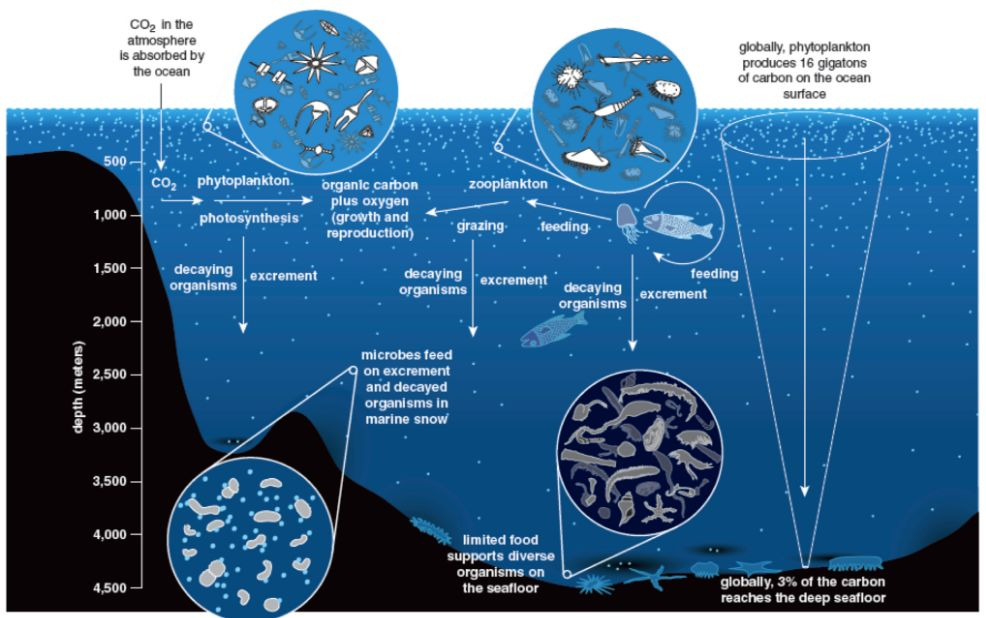

“海雪”落到海床上以后，会成为底栖生物和微生物的大餐。然而，这场大餐虽然美味，却也暗含杀机——荷花池里，生物作用（腐烂）形成的沼气、硫化氢等气体会自然释放，但在压强巨大的海底，一些有害气体却会逐渐积累。

享用着这最后的晚餐，消耗着水底本就不多的氧气，然后被高度富集的硫化氢杀害——这样，海底/湖底的淤泥会很自然的倾向于出现富含硫化氢的还缺氧原环境。

硫化氢的毒害作用、缺氧环境会导致好氧微生物的幸存种类大大减少，而淤泥逐渐埋深愈发紧实的过程也会慢慢的杀死耐硫化氢微生物，最终创造出利于有机物保存的沉积物环境。

# 从淤泥到石油的漫长旅程，从地壳的沉降开始
智人这个物种的生命太过短暂，于是该物种的许多个体对于巨大时间尺度的事件无法理解。如果他们能够快进着看地球的历史，才发现他们以为的天长地久其实只是一厢情愿。

许多人或许对地壳在水平方向的运动有所了解——板块漂移；但是对地壳在垂直方向上的运动往往只了解一半：板块相撞，发生造山运动抬升高原与山脉的那一半。这不被人们了解的另一半，是垂直沉降。

只有垂直沉降，才让一片海域或一个湖泊沉积成千上万米厚的沉积物，然而水深只有沉积物厚度的零头，或者地表保持平原的状态。

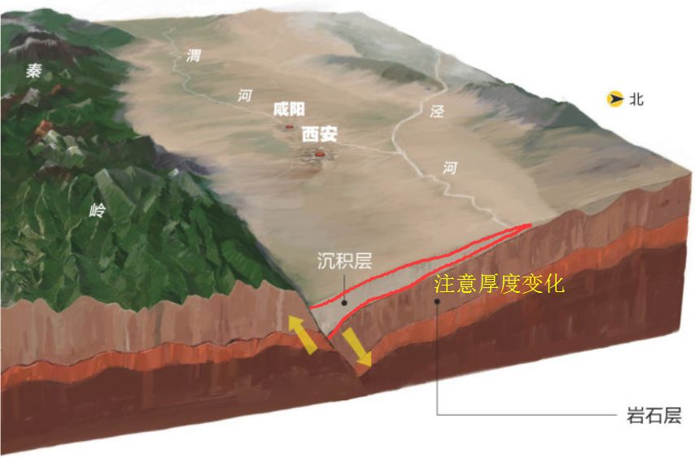

人们总是习惯了看头顶的蓝天，看远方的白云，很少有人愿意俯下身看看脚下的大地。可当我们真的借助科学手段探索这片土地，却发现它有着不输于蓝天和远方的精彩。它埋藏了古老的海洋，消亡的湖泊；它从一个小洼地演化为一个巨型湖泊，然后填满泥砂变成平原；它从古代的崇山峻岭逐渐演化为汪洋一片，然后又从海面下崛起变成陆地。

沧海桑田，并不仅仅是海平面高一点或者低一点，它的背后其实隐藏着地壳的大规模垂直升降过程，以及随着这个过程一起保存在地层里的有机物。

# 眺望贝加尔湖，思考它的“深度”
现如今，贝加尔湖的古老基底依旧在地壳拉张的作用下快速沉降——这个快速，是指每年0.03-0.3mm，根据不同位置而变化。

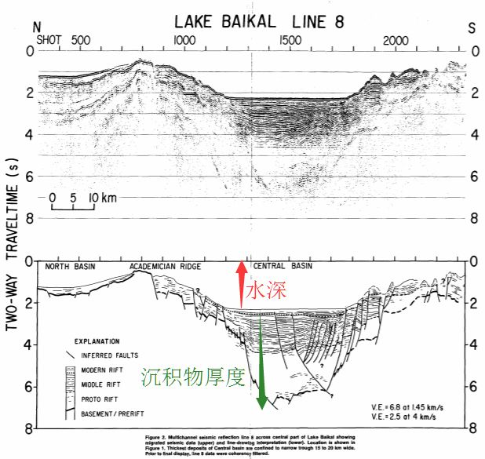

对于人类来说，这个速率让人无法察觉。可如果用这个速率乘以贝加尔湖的年龄：2500万年至3000万年的话，沉降量是多少呢？

最大值大概是0.3mm*30,000,000=9,000,000mm=9km，最小值把小数点往前拨一位，900m。

这也就意味着，贝加尔湖形成之初堆积的沉积物及其中的有机质，现在可能位于最深9000米的地下。有谁知道中国最深的石油钻井有多深？不到8500m。

众所周知，地下越深处，温度和压力也越大。淤泥会在压力的作用下逐渐变成泥岩，那么其中的有机物会在温度的作用下变成什么呢？

# 将地层放进高压锅：高温高压生成油气

复杂高分子有机物会在温度的作用下逐渐分解，发生热解反应和裂解反应.逐渐释放小分子有机物.

介绍有机地球化学领域的两个实验。

第一个叫做“干酪根分离试验”，它从泥页岩/其他烃源岩中分离出不溶于非氧化性的酸、碱、非极性有机溶剂的高分子复杂有机物——这种东西我们称其为干酪根。

第二个实验叫“黄金管热模拟生烃实验”，这个实验通过人工对富含有机质（残余干酪根）的泥岩（烃源岩）粉末进行加压加温，然后鉴定其在各个温度阶段释放的产物和产量。

干酪根是一种可以从烃源岩中提取出来的物质；

这种物质通过加压加温试验可以人为产生多种轻重烃类，形成似油气的物质；

不同类型的干酪根具有截然不同的生烃特性；

这就是油气有机成因的证据，实验室得到的。

# 海绵一样的岩石，我们叫它储集岩

对有一些岩石，用“海绵”来形容更为贴切。

一块普通的砂岩看起来是这样：

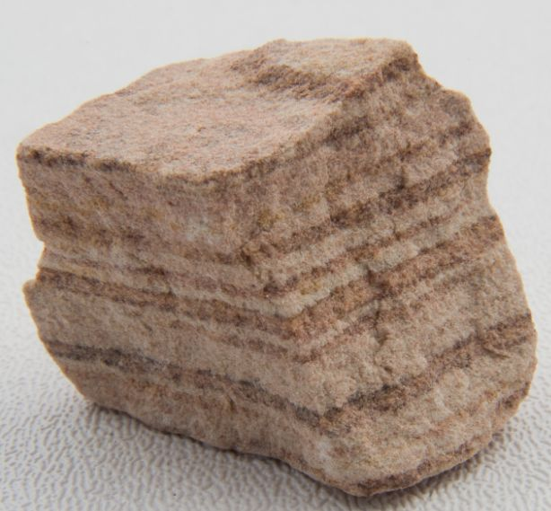

在偏光显微镜下看，有可能会是这样：

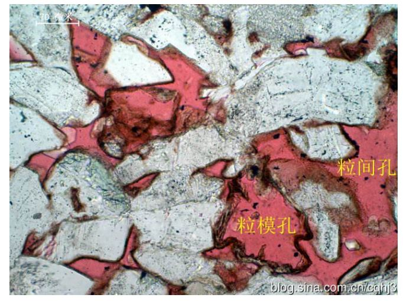
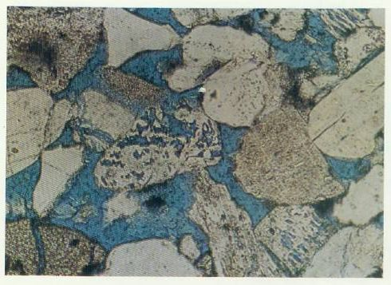

红色和蓝色是压注进砂岩的树脂，这些树脂占据了砂岩矿物颗粒之间的孔隙.

在扫描电镜下一般是这样子：

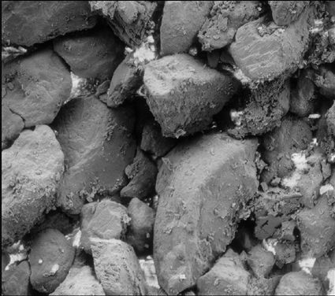

大块的脏兮兮的矿物颗粒，和颗粒之间黑色深邃的孔隙.

我们很容易就可以想到，在一些看似坚固的岩石中，实际上存在着复杂的孔隙结构。一些空间想象力不错的同志大约已经形成了一副沉积岩中孔隙结构的三维效果，理论上差不多会是下面这样：

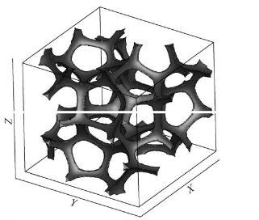

地下岩石的这些空隙里，显然充满了水，或者油气——这才是油气在地下的主要面目（次要面目要考虑岩石的裂缝、地层中稍大一些的洞穴）。

但对于更加致密的泥/页岩，孔隙的总体积要远远比砂岩小。

# 离开摇篮，走向未知：油气的初次运移

当一个人类族群受到逐渐增大的环境压力，且群落内个体数量不断增大的双重压力作用时，小群体的离开与出走会成为常态。类似的情况，我们可以套用到烃源岩里的油气。

不断埋深的烃源岩层，受到各种来自外界的压力：比如上覆地层巨大的压力；在它内部，不断生成的油气（还有一些矿物释放的水）也在慢慢占据本就不多的孔隙空间，形成内在压力。

这些有机油气需要有个去处。作为孔隙较少的致密岩石，烃源岩内“缺乏收纳空间”，不断形成的油气会在“后浪挤前浪”的排烃压力、地层压力和自身内部愈演愈烈的超压作用下向烃源岩外排出。

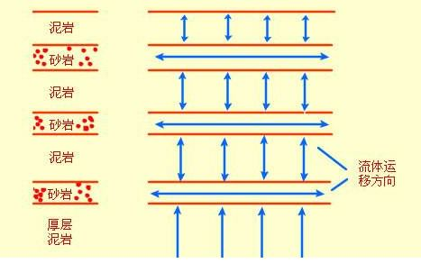

只要是能够离开烃源岩的方向，都是走出摇篮的道路，无论向上还是向下.

# 油比水轻，气更轻——向上，向上，向上：油气的二次运移

浮力让一切都试图向上运动，包括油气。自由任性的向上缓慢流动才是地下油气世界的真实面目。直到遇到阻碍流不动为止——这样的阻碍，往往来自致密缺孔的岩石。它可以是覆盖全盆地的厚层泥岩，可以是蒸发岩，可以是封闭性断层，还可以是致密的上涌岩浆岩。

一整个盆地范围（想想华北平原有多大？）内的烃源岩源源不断的形成并排出油气，这些油气在地层里四处缓慢流动，寻找着一切能让自己驻足的地方——这些吸引油气停留的地方，往往是渗透性岩石与非渗透岩石巧妙结合，被构造运动和地层形态精密控制的地区——我们称呼它为圈闭（trap，字面意为陷阱）。

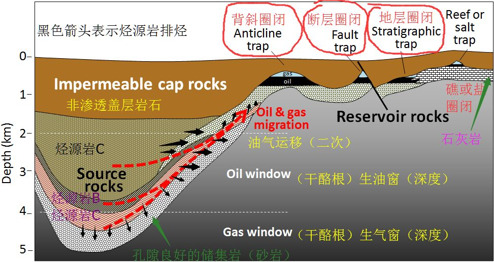
（综合体现一个盆地内，深部烃源岩的油气经过初次运移（排烃）、二次运移进入圈闭的示意图）

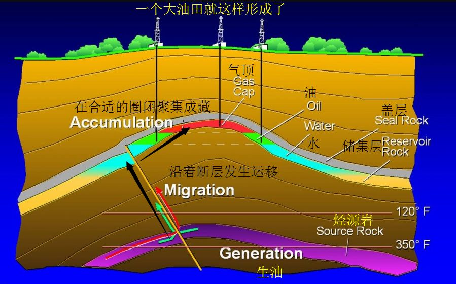
（对流体开放的断层也是很好的二次运移通道）

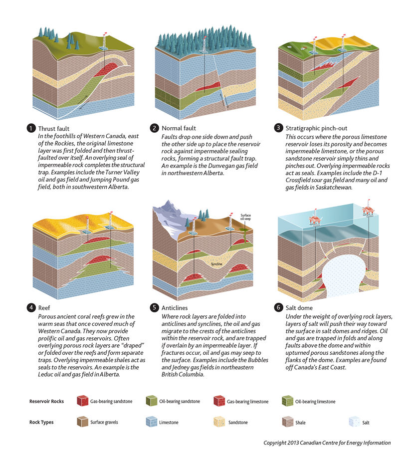
（一些常见的圈闭类型。shale作为烃源岩，limestone和sandstone都是良好的储集层；在不能继续上浮的角落里聚集形成油藏，许多个这样的油藏经过开采就是大油田。）

这就是所谓“超大规模油田”的来历.

“超大规模”看起来很唬人，但其实就是几个大号的圈闭而已，比起整个盆地来说，太微不足道。

# 总结
油气的有机成因学说，是经过实验提出理论、理论指导勘探、勘探成功案例不断完善理论的极富生命力的学说。自从它在上个世纪六七十年代提出，经过近半个世纪的发展，它在全世界范围内指导了无数的油田获得勘探成功。

1. 有机物残骸分散沉降在水底软泥里，被水底微生物消耗一部分后，被水底自发形成的缺氧还原环境保存下来；【有机质的来源与保存】
2. 水底软泥逐渐演化为泥/页岩，有机质则经过热演化逐步成为复杂干酪根；【从基本生物残骸转变为性质稳定的干酪根】
3. 水底软泥逐渐演化为泥/页岩，有机质则经过热演化逐步成为复杂干酪根；【从基本生物残骸转变为性质稳定的干酪根】
4. 干酪根在不断增大的压力和温度作用下开始依次发生热解和裂解反应，释放大量油状烃类物质，这一过程得到了充分的实验室证实；【烃源岩中的有机质发生化学反应，释放油气】
5. 地质沉降过程的继续，伴随着沉积体系的沧桑巨变，不同性质的地层渐次形成；【沉积盆地内形成多种岩石类型，提供丰富的生储盖组合】
6. 烃源岩逐渐生烃，在内外的巨大压力下将烃类物质排出；【初次运移，或称排烃，将烃类物质从烃源岩里释放到周围储集层中】
7. 主要在浮力的作用下，油气在储集层里发生运移，直到无法继续上浮为止；【二次运移，直到遇到具有特殊构造形态、特殊储盖组合的圈闭】
8. 这些圈闭里的油气在漫长的地质变迁中幸存下来，活到了19世纪中后期，被人类逐渐发现；【一个个沉积盆地内装满油气的圈闭被发现，一个个大油田拔地而起】
9. 随着勘探手段和地质认识的不断进步，许多过去被忽略的、未发现的油藏终于又被揭露出来，石油峰被一而再、再而三的推迟；【我辈石油人的骄傲与自豪，希望与夕阳。】

但是，天下没有不散的宴席。人类消耗油气的速率远大于自然界逐渐生成的速率。油气在经济意义上的枯竭，只是一个时间问题。新能源的发展与逐步取代油气，势在必行。

# 关于近期社交平台热议的无机成因的评价
油气的无机成因学说，它源自于19世纪后期，并且获得了无机成因天然气田的勘探验证。但这个学说的问题在于，它尚未指导一个油田取得勘探成功，反倒失败了不少探井。

实践是检验真理的唯一法宝。不管有关研究者多么坚持，提出多么令人眼花缭乱的理论来丰富无机成因理论，但事实却是残酷的：**还没有在地球上发现无机成因能够形成更重的液态烃的任何证据，实验室里没有，勘探实践里也没有**。

最近有一篇从今日头条传播出来的文章，用“五亿年前的恐龙”这样令人匪夷所思的语言，大谈特谈石油有机成因不靠谱和“没有科学实证”，表示有机成因学说“是精心编制的谎言”。
>按照石油化石学说，要生成该油田已产出的石油，需要一个长宽高各30公里的立体空间，在里面填满恐龙肉，而且还要100%转化为石油。这简直是荒谬至极。

但是用这种看似合乎情理，实则文词间漏洞百出，用塑造受压迫形象甚至鼓吹西方学术阴谋的伎俩，描绘一幅西方国家打压发展中国家的画面，煽动广大行业外群众参与到一个自己完全不了解的学术争论里来，实在令人摇头。
