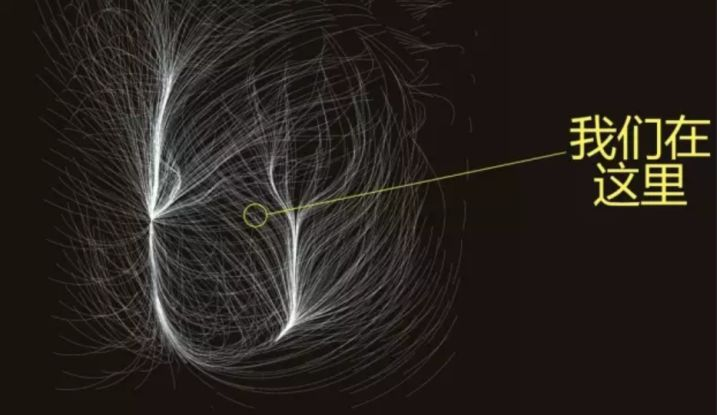
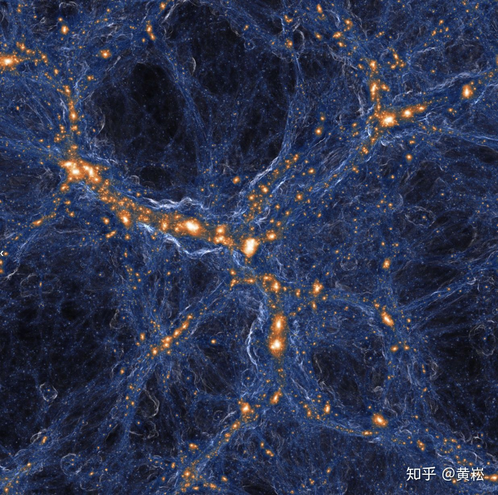

https://www.zhihu.com/question/278422744

# 星系群和星系团、超星系团一般是怎样的结构？
以银河系为代表的星系有很多旋臂型，还有些椭球型星系。

而拉尼亚凯亚超星系团的示意图看起来是纤维状，感觉不太“自然”。

这应当看作是尺度不同引起的？

也就是说，那么大的尺度呈现那个样子就是“自然”的。

还是说巨大的尺度尚未有足够时间演化成比较“自然”的形式？

****************************

问题里的图是我们所处的大尺度结构中星系速度场的一个巧妙可视化，严格意义上不代表这个“超星系团”的物质分布结构。

既然问了这三个概念，后面多废话几句吧，普及一下这几个定义的现代观点。星系群 (Group)，星系团 (Cluster), 超星系团 (Supercluster) 都是什么？这几个从“传统”星系天文中诞生出的概念也正在不断被更好的观测翻新着。

人类认识星系的过程是一个由表象到本质的漫长过程。在早期，天文学家们通宵达旦地曝光，才能趴在玻璃底片上认证出一个个暗淡的恒星岛。但即便是这个时候，天文学家已经意识到在天空中星系的显著聚集不是视线方向重合的假象。50年代，George Abell就已经订正了包含北天2000多个星系团的源表。同一时期，Fritz Zwicky已经通过后发座星系团内8个星系的速度分布发现了星系团质量可能比可见的大很多这个被忽视了很久的结论。但一直到冷暗物质宇宙学模型确立后，在大尺度的巡天观测出现之前，天文学家们还是单纯地以计数来定义星系的聚合：30-50个以上的星系聚集在一起，恩，星系团；30个以下？对不起，星系群。好玩的是，天文学家给这个数量起了个名字，叫“Richness”。。想来星系团的场子玩？先砸下几张大票子吧。。。

长话短说，随着观测宇宙学成熟，暗物质宇宙学模拟出现，星系巡天出现，天文学家们在过去30年的时间里把暗物质为基础的宇宙物质分布和演化模型推到了聚光灯下。天文学家这才意识到，暗物质的拍山巨浪卷来，星系只是浪头的点点泡沫。

在这样一个：早期宇宙密度涨落决定暗物质分布和演化 --> 重子物质在暗物质晕内坍缩形成星系 --> 星系随着暗物质晕的吸积和并和不断演化的画面下，星系的聚集结构也有了更为物理的解释：随着演化，在一个自引力束缚的暗物质晕内可以聚集了不同数量的星系。这些星系的数量，曾经是我们分类星系群和星系团的基础，但既然这些星系的运动都在暗物质晕的引力约束下，其演化也在很大程度上被其“宿主”暗物质晕控制，那么显然是暗物质晕质量这个物理量更有意义了。

现代天体物理观点下，星系群和星系团只是粗略地描述暗物质晕质量范围的一个说法。一般来说，质量大于10^14个太阳的暗物质晕就是一个星系团；如果暗物质晕质量比这个小，那么就叫星系群好了。即便是在这个分类也只是约定俗成的一个“说法”，谈不上严格的边界。

目前观测上被使用次数最多的星系群表来自上海交通大学的杨小虎教授利用斯隆数字巡天的数据发布得到的，包含了30多万个近邻宇宙里的星系群。这个表格被使用得如此之多，以至于你报告里直接说 “杨 et al.”，全场的宇宙学家都会跟着点头。好玩的是，在这个表格里，你会发现只包含一个星系的“星系群”。《国语》云，“兽三为群”，这一只星系就“群”是不是有点太不尊重本地的帮会了？但其实这样是没问题的，如果一个星系有足够大的恒星质量，即便你在他周围没看到任何其他伙伴，从统计上我们也比较确定他一定生活在一个质量很大的暗物质晕里面。所以，群！

不过，虽然天文学家已经心安理得的用暗物质晕在定义群和团了，但观测上想直接测量暗物质晕总质量那是相当的难的。即便在手握弱引力透镜，星系运动学，X气体发射，星系团热气体对宇宙微波背景辐射的逆康普顿散射 (所谓Sunyaev-Zeldovich效应) 这些工具，我们也只是对部分最大质量的星系团和少数近邻的星系群有了直接的测量。真的在观测中，天文学家们发现，星系群的“账户余额” (richness)还是很好使的：一定质量以上的星系在一定范围内聚集的数量和他们的暗物质晕结构的质量是有很好的相关的。斯坦福大学Risa Wechsler教授和天文学家Eli Rykoff，Eduardo Rozo等人一起开发了一个叫做“redMaPPer”的算法，通过对一定性质的星系进行更聪明的“计数”得到了非常好用的星系团探测器，在暗能量巡天等观测项目里大展身手。

至于“超星系团”，这个概念其实更不明确。传统上一般看到几个星系团离得比较近了，就叫一个超星系团，实在是天文学家们命名概念时懒惰的恶习不改。和星系群还有星系团这样的自引力束缚的概念不同的是，超星系团本身并不是一个严格引力束缚的系统，只能说几个大质量的暗物质晕聚集在一起，产生的引力可以在局部对抗宇宙膨胀，对附近星系的运动产生显著的影响而已。银河系附近很多星系的视线方向速度并不符合哈勃定律给出的距离和退行速度的关系，其实就是因为受到了更大尺度上的星系聚集的引力影响。

至于提问者说的“怎样的结构？” 对于星系群和星系团，统计上来说都是在暗物质晕的中心星系密度更高，然后星系数量随着到暗物质晕中心距离下降的。不过星系在暗物质晕里面是不停运动的，而且暗物质晕之间也在不停地相互影响或者并和，因此单个星系群或者星系团里面的星系分布是可以很复杂的。大质量星系团的中心往往可以看到一个巨大的星系端坐不动，那是因为这个胖子吃得太多不太跑得起来了；而小质量的星系群里面则可以看到更随意的星系分布。

至于超星系团，应该说在宇宙结构演化的视角下，超星系团是更大尺度上物质分布的一个特写吧。现代巡天和数值模拟告诉我们，宇宙中结构在几千万秒差距以下的尺度下是不大均匀的。源于早期宇宙演化产生的密度分布不均，往往形成物质分布集中的“节点” (knot) 和联结这些节点的“纤维” (filament) 。而超星系团，往往是在这样的节点和纤维上。下图来自最新出炉的Illustris-TNG100宇宙学磁流体力学数值模拟的一个局部，反应了暗物质密度分布和其中气体速度的分布。图中每一个鲜艳的亮点都是一个质量不小的暗物质晕。而图片中央靠左连成一片的纤维，如果和现实观测对应起来，差不多就是一个超星系团了。

当然，在观测上，我们是看不到这么炫酷地结构的。只能从一定距离范围内星系分布中瞥见大尺度质量分布的只言片语。

至于你要问，大尺度上这样纤维状的物质分布结构是如何来的？这就完全超出我的本科生宇宙学基础了。。。不过，去年年底我在纽约大学访问的时候碰巧听到过约翰.霍普金斯大学的数学家Mark Neyrinck介绍如何在高维空间里玩“折纸”，折叠出宇宙的纤维和节点。

